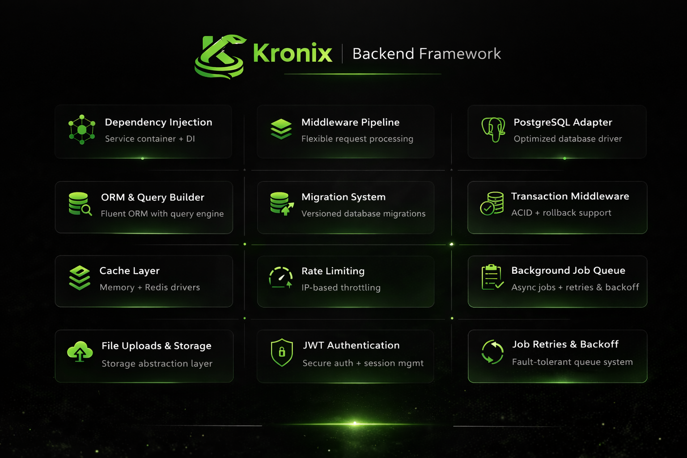

# 🐍 Kronix
### A fast and flexible web framework for Dart.

[](https://pub.dev/packages/kronix)
[](https://opensource.org/licenses/MIT)

Kronix is a web framework for the Dart ecosystem designed for performance and ease of use. It includes everything you need to build web applications without the boilerplate, including routing, dependency injection, and a lightweight ORM.

---

## 🚀 Key Features

- **Fast Routing**: Radix-Trie based router for efficient path matching.
- **Dependency Injection**: Hierarchical DI with request scoping.
- **ORM**: Active Record pattern with support for relationships (`belongsTo`, `hasMany`).
- **Security**: Built-in body size limits, backpressure control, and JWT support.
- **Caching**: Simple cache facade with Memory and Redis drivers.
- **CLI**: Scaffolding for controllers, models, and migrations.
- **Real-time**: WebSocket support with rooms and middleware.

---

## 🏁 Quick Start

### 1. Installation

Add `kronix` to your `pubspec.yaml`:

```yaml
dependencies:
  kronix: ^0.2.0
```

### 2. Basic Example

```dart
import 'package:kronix/kronix.dart';

void main() async {
  final app = App();

  // Simple GET route
  app.get('/welcome', (ctx) async {
    return Response.json({'message': 'Welcome to Kronix!'});
  });

  // Validation example
  app.post('/register', (ctx) async {
    final data = await ctx.validate({
      'email': 'required|email',
      'password': 'required|min:8',
    });
    
    return Response.json({'status': 'registered', 'user': data['email']});
  });

  await app.listen(port: 3000);
}
```

---

## 🛠 Features

### ORM (Active Record)
Define relationships easily:

```dart
class User extends Model {
  @override String get tableName => 'users';
  
  Future<List<Post>> posts() => hasMany<Post>(Post.fromRow);
}
```

### Caching
Switch between Memory and Redis with config:

```dart
final stats = await Cache.remember('users.count', Duration(hours: 1), () async {
  return await User.query().count();
});
```

### Middleware
Group routes and apply common logic:

```dart
app.group('/api/v1', middleware: [AuthMiddleware()], callback: (router) {
  router.get('/profile', ProfileController().show);
});
```

---

## 🤝 Contributing

We welcome contributions! Please see our [Contributing Guide](CONTRIBUTING.md) to get started.

## 📄 License

Kronix is open-sourced software licensed under the [MIT license](LICENSE).

